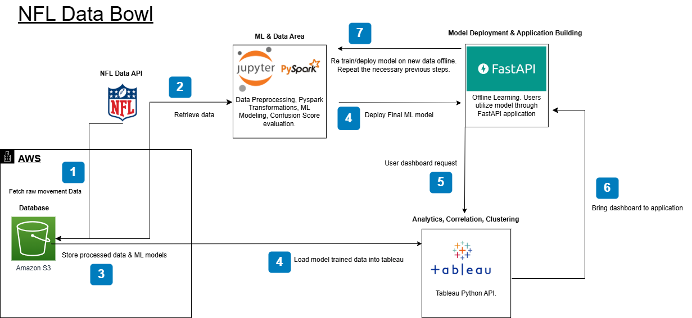

# Project Charter

## Problem description

&nbsp;&nbsp;&nbsp;&nbsp;&nbsp;&nbsp;&nbsp;&nbsp;&nbsp;&nbsp;&nbsp;&nbsp;&nbsp;&nbsp;&nbsp;&nbsp;Pre-snap defensive confusion occurs when defenders exhibit signs of miscommunication, hesitation, or last-second adjustments before the snap, often leading to coverage breakdowns or poor positioning. Our goal is to identify and quantify these moments using tracking data, along with utilizing machine learning and data analytic techniques. We will analyze features that quantify erratic defensive player movements, such as frequent direction changes, crossing paths, late alignments, and sudden shifts in response to offensive motion. Using these features, we will develop a Confusion Score—a numerical representation of how disorganized a defense appears before the snap.

&nbsp;&nbsp;&nbsp;&nbsp;&nbsp;&nbsp;&nbsp;&nbsp;&nbsp;&nbsp;&nbsp;&nbsp;&nbsp;&nbsp;&nbsp;&nbsp;Once we have a reliable Confusion Score, we will explore its impact on game success through correlation analysis and clustering, identifying patterns in defensive formations that are most susceptible to confusion. Finally, we will train a predictive model to detect pre-snap confusion in real-time, providing insights into which teams and defensive schemes struggle most against motion-heavy offenses. This project will offer a new way to quantify defensive breakdowns.

&nbsp;&nbsp;&nbsp;&nbsp;&nbsp;&nbsp;&nbsp;&nbsp;&nbsp;&nbsp;&nbsp;&nbsp;&nbsp;&nbsp;&nbsp;&nbsp;This data science project is important, as it allows teams to better exploit defensive weaknesses and improve communication strategies. Defense is vital to winning NFL games and for teams to reach big games like the superbowl, and so our project will help NFL teams improve their defense which in return would help them play better and be more successful  overall.

## Scope

&nbsp;&nbsp;&nbsp;&nbsp;&nbsp;&nbsp;&nbsp;&nbsp;&nbsp;&nbsp;&nbsp;&nbsp;&nbsp;&nbsp;&nbsp;&nbsp;Our project aims to develop a machine learning-driven Confusion Score to quantify pre-snap defensive disorganization using NFL player tracking data. Defensive confusion, defined as late, erratic movement, or misalignment before the snap, often results in coverage breakdowns and successful offensive plays. By analyzing the defenders’ pre-snap motion patterns, we will create a quantitative metric that correlates with negative defensive outcomes such as yards allowed, completion percentages, and down conversions.  

&nbsp;&nbsp;&nbsp;&nbsp;&nbsp;&nbsp;&nbsp;&nbsp;&nbsp;&nbsp;&nbsp;&nbsp;&nbsp;&nbsp;&nbsp;&nbsp;To achieve this, we will collaborate to build a data science solution. First, we will develop an understanding of the data to conclude what contributes to confusion, and then assign weights to key confusion indicators. Then, we will refine this metric using supervised learning techniques to optimize feature weightings based on plays where confusion was identified. Our model will be validated by analyzing its correlation with play success metrics and benchmarked against given defensive performance indicators.

&nbsp;&nbsp;&nbsp;&nbsp;&nbsp;&nbsp;&nbsp;&nbsp;&nbsp;&nbsp;&nbsp;&nbsp;&nbsp;&nbsp;&nbsp;&nbsp;We will train a predictive model that is capable of detecting pre-snap confusion using real, modern NFL game data. This model will allow NFL teams to assess their defensive vulnerabilities and adapt their game strategies accordingly. Additionally, we can expand on our model to determine which defensive formations and personnel are most prone to confusion and identify offensive motions that consistently induce breakdowns. 

&nbsp;&nbsp;&nbsp;&nbsp;&nbsp;&nbsp;&nbsp;&nbsp;&nbsp;&nbsp;&nbsp;&nbsp;&nbsp;&nbsp;&nbsp;&nbsp;Our final deliverables include a deployable Confusion Score metric, a machine learning-based confusion detection model, and detailed team-level analysis. Insights will be integrated into an interactive dashboard, enabling coaches and analysts to identify patterns, adjust defensive schemes, and exploit weaknesses in opposing teams. By providing data-driven clarity on pre-snap defensive breakdowns, our solution will serve as a valuable tool for game planning, scouting, and in-game decision-making, ultimately giving NFL teams a competitive edge in both offensive play-calling and defensive coordination.

## Personnel
The team for this project consists of:  
- **Ethan Bailey**  
- **Fuad Hassan**  
- **Charlie Morgan**  
- **Paige Reece**  
- **Ashwin Verma** 

### Team Roles & Responsibilities  

- **GitHub Management:** The repository was created and will be managed by **Fuad Hassan**.  
- **Trello Board:** The Trello board was created and will be managed by **Paige Reece**.  
- **Equal Contribution:** All team members will contribute evenly throughout the project.  

### Phase Breakdown  

#### **Phase 1: Identifying Confusion Indicators**  
- Each member brainstormed potential confusion indicators based on **movement, alignment, and reaction**.  
- Work will be divided to ensure each member validates different features to determine if they should be included.  
- Findings will be reviewed, and the final list of validated confusion features will be decided collectively.  

#### **Phase 2: Dataset Collection & Model Training**  
- Each member will collect and build an equal number of **rows** for the training dataset to ensure workload balance.  
- Once the dataset is complete, the team will collaboratively:  
  - Develop the **rule-based confusion score**  
  - Train the model  
  - Refine feature weights  

#### **Phase 3: Final Report & Presentation**  
- The entire team will work together to complete the **final report and presentation**.  
- Any additional tasks will be assigned and tracked via **Trello**.  

	
## Metrics  

To effectively measure the success of our project on Pre-Snap Defensive Confusion Analysis, it's essential to establish clear metrics that evaluate both the accuracy of our confusion Score and its practical impact on game outcomes. Here are some key considerations:  

### **Confusion Score Validation**  

- **Correlation with Play Outcomes**  
  - Assess how well the confusion score predicts negative defensive outcomes, such as:  
    - Yards gained by the offense  
    - Completion percentage of passes  
    - Third-down conversion rates  

- **Comparison with Established Metrics**  
  - Compare the confusion score against existing defensive performance metrics to evaluate its effectiveness.  

### **Model Performance Metrics**  
To assess the effectiveness of our model, we will measure:  
- **Accuracy**  
- **F1 Score**  

### **Impact Analysis**  

#### **Team-Level Analysis**  
- Determine if **higher average confusion scores** correlate with poorer defensive statistics, such as:  
  - Higher points allowed per game  

#### **Formation and Motion Impact**  
- Analyze which **offensive formations or motions** most frequently lead to a high confusion score.  

#### **Comparative Analysis**  
- **Benchmarking Against Other Teams**  
  - Compare our findings against other teams to evaluate defensive performance trends.  

## Plan  

### **Phase 1: Understanding the Dataset & Identifying Confusion Features (Weeks 1-3)**  
**Goal:** Develop a clear understanding of the dataset and define potential indicators of pre-snap confusion.  

#### **Dataset Exploration:**  
- Load and analyze the tracking data to understand available features (e.g., player positions, movement speeds, direction changes).  

#### **Feature Identification:**  
Identify key indicators of defensive confusion, such as:  
- Erratic movement (frequent direction changes)  
- Crossing paths between defenders  
- Late alignments relative to the snap  
- Sudden shifts in response to offensive motion  
- Facing the wrong direction at the snap  

#### **Validation Plan:**  
- Establish criteria to confirm that identified features truly represent confusion:  
  - Review clips of plays with extreme feature values (e.g., defenders with high direction changes) to check if they actually appear confused.  
  - Compare feature values against play success metrics to see if confusion indicators correlate with coverage breakdowns.  

#### **Splitting Up the Work:**  
- Everyone will spend time understanding the dataset individually to get familiar with the structure and available features.  
- Each team member will brainstorm potential confusion indicators based on movement, alignment, and reaction.  
- The team will combine all ideas and finalize a list of confusion features to test.  
- Work will be divided so that each person is responsible for validating different features to determine if they should be included.  
- Team members will report back their findings, and the final list of validated confusion features will be decided collectively.  

**Deliverable:** A finalized list of confusion-related features.  

---

### **Phase 2: Assigning Confusion Scores & Finding Optimal Weights (Weeks 4-9)**  
**Goal:** Develop a confusion score formula, a training dataset, and refine the confusion score using a supervised learning model.  

#### **Constructing the Confusion Score:**  
- Develop an initial Confusion Score formula by assigning equal weights to selected confusion-related features.  
- Features may include:  
  - `avg_direction_changes`: Average number of direction changes per defender.  
  - `max_direction_changes`: Maximum number of direction changes by any single defender.  
  - `avg_time_to_react`: Average time delay in reaction to offensive motion.  
  - `num_players_out_of_position`: Count of defenders not properly aligned at the snap.  

#### **Creating the Training Dataset:**  
- Construct a dataset where each row represents a single play, using the confusion-related features from the Confusion Score as columns.  
- Assign a binary confusion label (`confused_play`) for supervised learning:  
  - Manually review a sample of plays to determine whether confusion was present.  
  - Incorporate offensive success metrics (e.g., high completion %, wide-open receivers) to aid in classification.  
  - Label plays as **1 (confused)** or **0 (not confused)** for model training.  

#### **Feature Weight Optimization:**  
- Train a logistic regression (or similar model) to learn optimal feature weights based on confusion labels.  
- Evaluate how strongly each feature contributes to confusion.  

#### **Model Evaluation & Refinement:**  
- Test the trained model on labeled data and assess its correlation with offensive success.  
- Adjust feature selection and weightings based on performance.  
- Ensure the Confusion Score aligns with real pre-snap confusion scenarios by validating it against play breakdowns and film.  

#### **Splitting Up the Work:**  
- Each team member will collect and build an equal number of rows for the training dataset to ensure a balanced workload.  
- Once the dataset is complete, we will work together to develop the rule-based Confusion Score, train the model, and refine feature weights.  

**Deliverable:** An accurate confusion score metric.  

---

### **Phase 3: Predictive Model & Analysis (Weeks 10-12)**  
**Goal:** Use the Confusion Score to train a model that predicts defensive confusion before the snap and analyze its impact on play outcomes.  

#### **Building a Predictive Model:**  
- Train a machine learning model to predict the Confusion Score for each play using only pre-snap features (e.g., formation, motion, defender positioning).  
- Identify which pre-snap factors contribute most to confusion.  
- Evaluate the model’s accuracy in estimating confusion before the snap.  

#### **Team & Scheme Analysis:**  
- Analyze which defenses and formations are most prone to confusion.  
- Determine whether offensive motion or pre-snap shifts significantly increase defensive confusion.  
- Investigate how confusion correlates with defensive breakdowns and big plays (e.g., yards allowed, completion percentage).  

#### **Visualizations:**  
Create visualizations to communicate findings:  
- **Heatmaps:** Showing confusion trends on the field. *(optional)*  
- **Scatter plots:** Relationship between confusion and offensive success.  
- **Bar charts:** Highlighting team and formation performance.  

##### **Final Report & Presentation:**  
- Summarize methodology, key findings, and model performance.  
- Provide insights for teams and coaches on how to exploit defensive confusion.  

**Deliverable:** A deployable confusion detection model, team/scheme insights, and visualizations to communicate findings.  

## Architecture

The architecture diagram for the project is broken down into 3 parts: data, modeling, and deployment.
###  **Data**
&nbsp;&nbsp;&nbsp;&nbsp;&nbsp;&nbsp;&nbsp;&nbsp;&nbsp;&nbsp;&nbsp;&nbsp;&nbsp;&nbsp;&nbsp;&nbsp;Since we need a designated data area to retrieve raw, processed, and ML model data, the best way to go about it would be to store everything within a cloud database, in this case utilizing AWS’s S3 buckets. This makes it easy for all team members to access the data from a centralized database for different components of the project like PySpark & Tableau. The raw data of player movements will be retrieved using the NFL API and will be in a tabular form. The processed data will be the raw data that is cleaned up and added with additional features/transformations. The ML model data will be the ML model that we can retrieve later on so we don’t have to keep training or fear losing our model.

### **Modeling**
&nbsp;&nbsp;&nbsp;&nbsp;&nbsp;&nbsp;&nbsp;&nbsp;&nbsp;&nbsp;&nbsp;&nbsp;&nbsp;&nbsp;&nbsp;&nbsp;Since we’re dealing with 10GB of player movement data and we have access to the machine learning cluster, the best way to do data preprocessing, features engineering, and ML modeling would be to use PySpark on a cell-based code execution platform like Jupyter. You can connect a machine learning cluster to PySpark using the “SparkSession” object. PySpark has transformation functionality which will be very useful when we want to add features and do operations on all of the big data. There also is the PySpark ML library, which will allow us to train models on any popular algorithm really quickly while utilizing the cluster. 

### **Deployment**
&nbsp;&nbsp;&nbsp;&nbsp;&nbsp;&nbsp;&nbsp;&nbsp;&nbsp;&nbsp;&nbsp;&nbsp;&nbsp;&nbsp;&nbsp;&nbsp;The easiest and most popular way of deploying our final ML model while also creating an application for users to use it, would be to utilize FastAPI. Within our application, users will be able to use our model to predict the confusion score based on various user inputs such as defense strategy. In addition, users will be able to get analytics on things such as correlations and clustering analysis of a team's strategy or data features using tableau dashboards. Based on what our user asks for within our application, we will accordingly send a request to Tableau which will already have the final ML model-trained data and will accordingly create a dashboard and send it back to the application for the user to see. Tableau has a Python API that we will utilize for this.

&nbsp;&nbsp;&nbsp;&nbsp;&nbsp;&nbsp;&nbsp;&nbsp;&nbsp;&nbsp;&nbsp;&nbsp;&nbsp;&nbsp;&nbsp;&nbsp;Other pieces of information are that since we won’t need to retrain the model that frequently, it’s not imperative for the model to stay online during retraining, and due to a lack of infrastructure and monitoring resources, we will choose to re-train/deploy using offline learning. Offline learning means that once there is enough new data for us to want to re-train/deploy the model, we will take the old model offline, retrain it, and deploy this new model back using FastAPI. For some time during the re-train/deploy phase, users will not be able to use our application and ML model, but for our use case, it is fine since re-training is not frequent. 

> **Note:** We need to add an endpoint for FastAPI, most likely between AWS SageMaker and AWS Lambda. Will decide this as the project goes on.

## Communication
&nbsp;&nbsp;&nbsp;&nbsp;&nbsp;&nbsp;&nbsp;&nbsp;&nbsp;&nbsp;&nbsp;&nbsp;&nbsp;&nbsp;&nbsp;&nbsp;Communication regarding this project will be spread over multiple platforms. Direct communication will occur through a discord server. Our organizational tool will be Trello. The board includes all deadlines for the project and will be our tool to keep track of the division of work throughout the project. The link for the trello board is listed below. 

[Trello](https://trello.com/b/KB0aKltg/nfl-data-bowl)